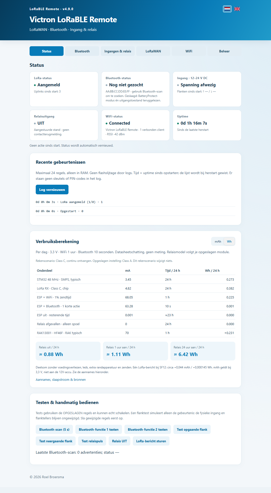

# Victron LoRaBLE Remote

The first wake-up command, without an always-on cellular modem.

[Nederlands](README.md) · [Installation](docs/INSTALL.md) · [UG65 / TTN](docs/NETWORKS.md) · [Examples](docs/EXAMPLES.md) · [Validation](VALIDATION-v49.md)

## Why?

A 4G/5G modem or WiFi router uses energy while waiting to be contacted. This
small node receives an initial LoRaWAN command, or a local input edge, and
operates Bluetooth or relay equipment to turn the larger load on. Turn it off
again when finished. The node and its LoRaWAN gateway must remain powered.

**Class C is not a microamp sleep mode.** It keeps the LoRa receiver available;
this firmware also keeps the STM32 awake. The partial datasheet model estimates
about 0.88 Wh/day with one hour of WiFi and no relay coil, excluding regulator
losses, LEDs and transmission. Savings depend on the modem's power and off-time.
See [power assumptions and sources](POWER-BUDGET.md).

## 4.9 test release

Smart BatteryProtect 12/24V-100A (product A3B1) was switched OFF and back ON
through the RAK/ESP. Independent PC Bluetooth reads confirmed both states.
ESP browser OTA recovered WiFi with the original spaced SSID and preserved settings.

- Up to **10 named Bluetooth functions**, added with +, each with stable downlink ID.
- Profiles: Smart MPPT LOAD, **Smart BatteryProtect second**, Generic Bluetooth GATT.
- Per-edge function/uplink/relay actions; per-function and per-relay downlink permissions.
- Class A or C; enabling a receive rule suggests C, explains power and server setup.
- NL/EN settings, help, backup/import, WiFi timing, RAM-only log, uptime and manual tests.
- Compact mAh/Wh daily estimate; no calculator inputs needed.
- STM32 USB update and ESP browser `.packed` update.

**Limitations:** real MPPT and RAK13007 tests are pending; TTN live testing is
pending; automatic two-network priority/failover is **not implemented**. The
internal stock-AT USEROTA bootstrap is experimental and has not been retested
end-to-end on a fresh factory module. This is not a universally validated
one-click installer or a safety-critical controller.

## Hardware

*UI example with simulated data, not a live gateway measurement.*

RAK11162 contains the RAK11160 module: STM32WLE5 for LoRa/control and ESP8684
for WiFi/Bluetooth. The tested setup uses the RAK19010 base and RAK19012 USB/
LiPo/solar power module; RAK19016 is an alternative 5–24V power module.

Optional I/O: RAK13001 has one isolated **12–24V DC input** and one non-latching
relay. RAK13007 has one non-latching relay and no input; its physical test is
pending. Select the actual board manually; there is no automatic detection.
No I/O board is required for LoRa → Bluetooth.

Never connect 12V to MCU pins. RAK13001 is not specified as a reliable 5V input.
A rising edge means external voltage appears, falling means it disappears;
the optocoupler internally inverts it. Check DI routing to WB_IO3 and relay
WB_IO4. Boot itself does not synthesize an edge. Relay contacts do not supply
power: check voltage/current/inrush ratings and use a fuse. Fit the correct
LoRa and 2.4GHz antennas.

## Setup

1. Follow [installation](docs/INSTALL.md) for both processors.
2. Connect to the board's WiFi and open http://192.168.4.1/. Public first-boot
   defaults are SSID `Victron LoRaBLE Remote`, password `CHANGE-ME-FIRST`.
   Change the password immediately. WiFi remains available for one hour after boot.
3. Select profile, target MAC and actual Bluetooth PIN. Victron pairing is mandatory.
4. Add named functions with +. All functions target **one configured device**,
   not ten separate devices. BatteryProtect uses instance 0.
5. Choose the I/O board and per-edge actions, if fitted.
6. Enter your own [LoRaWAN credentials](docs/NETWORKS.md). DevEUI is read from the RAK.
   Enable only desired downlink permissions. Set Class C on both node and server
   for prompt reception; Class A receives only after an uplink.
7. Save to persist/reboot, then test without a connected load.

Public binaries contain no installation keys and leave unknown hardware/actions
disabled on first boot. Existing saved settings are retained during updates.

## Downlinks and status

Use **hex bytes**, not ASCII, on the configured FPort (default 10):

| Hex | Action, when permitted |
|---|---|
| 01 … 09, 0A | Bluetooth function 1 … 10 |
| 10 / 11 / 12 | Relay OFF / ON / pulse |
| 20 | Request status |

Function 10 is **0A**, not byte 10. Removing only the last function preserves
existing IDs. Bluetooth actions execute their stored recipe; the pulse applies
to the local relay. The [codec](stm32/ug65_payload_codec_v4.js) supports UG65
`Decode` and TTN `decodeUplink`. Schema 4 distinguishes MPPT mode from
BatteryProtect output state. A received request is not proof of execution.

BatteryProtect mode and output must both read back correctly; other variants
are refused. No BMS mode or protection thresholds are changed. MPPT offers eight
LOAD modes; user-defined/AES use thresholds/times already configured in VictronConnect.
Physical MPPT validation is pending. Generic supports full service/characteristic
UUIDs and 1–20 data bytes, write-with-response and optional exact readback.
No scripts or generic notification-based protocol interpreter are provided.

Retries happen only after a failed first attempt. WiFi pauses for Bluetooth;
the target is not permanently connected.

## Storage, updates, development

Two alternating CRC-checked STM32 records store configuration. Unchanged saves
avoid a new configuration write. Logs (24 entries), observations and uptime are
RAM-only. Necessary LoRaWAN counters/nonces may still use RUI NVM. Backups omit
PIN, AppKey, WiFi password and device/join identity; imports preview then populate
the form before explicit save.

ESP OTA has **one application slot, no automatic rollback and no digital
signature**. Use trusted compatible files and uninterrupted power. STM32 updates
still require USB; this is not whole-device wireless OTA.

Arduino source: [stm32/stm32.ino](stm32/stm32.ino), RUI BSP 4.2.4.
`tools/build.ps1 -Public` excludes private local settings. ESP uses IDF 5.5.5,
ESP32-C2, 26MHz/2MB. Web source is `web/index.html`; generate with
`node tools/build-web.mjs`. See [validation](VALIDATION-v49.md) and
[release steps](docs/RELEASING.md).

Own project code: MIT, © 2026 Roel Broersma. Dependencies retain their
[separate terms](THIRD-PARTY-NOTICES.md). Independent project, not endorsed by
Victron Energy or RAKwireless.
