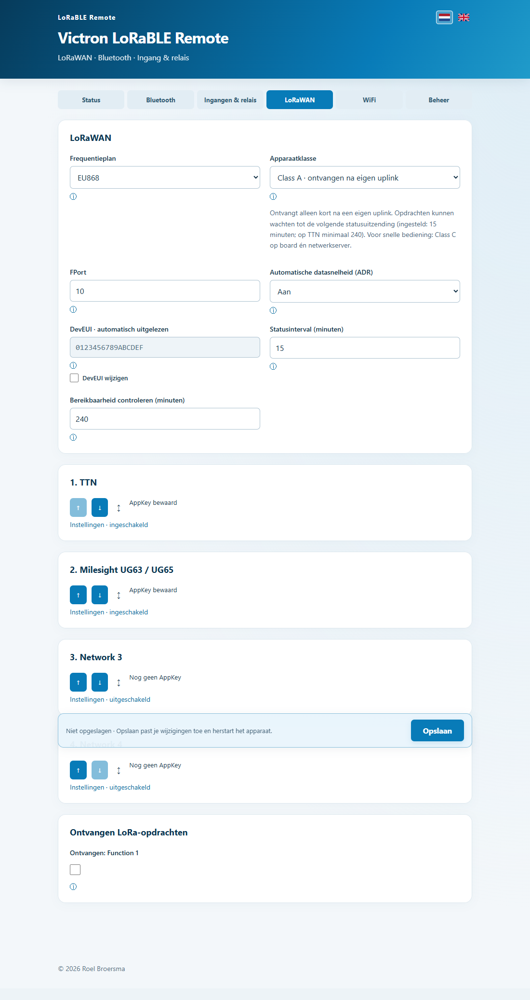
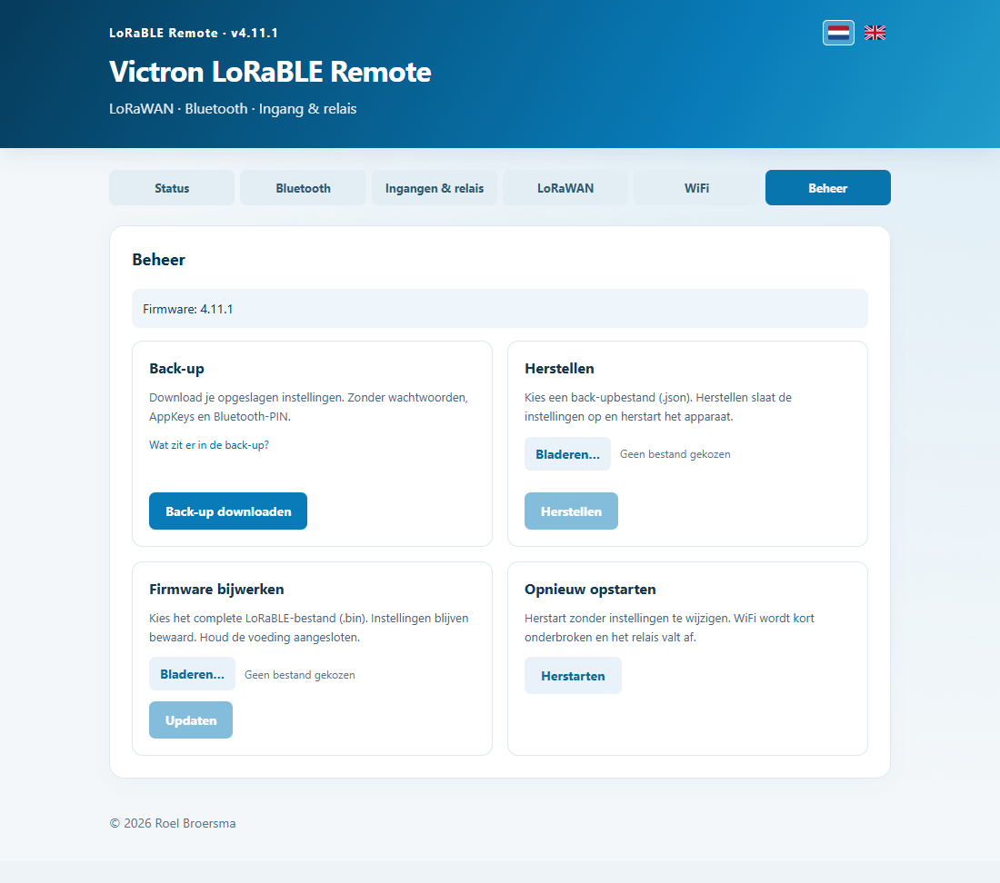

# Victron LoRaBLE Remote

**Zet je modem, router of andere apparatuur pas aan wanneer je die nodig hebt.**

[English](README.en.md) · [Download](https://github.com/roelbroersma/victron-lorable-remote/releases/latest) · [Installatie](docs/INSTALL.md) · [LoRaWAN instellen](docs/NETWORKS.md) · [Voorbeelden](docs/EXAMPLES.md)

LoRaBLE Remote ontvangt een LoRaWAN-opdracht en bedient een apparaat via **Bluetooth of een relais**. Zo kan bijvoorbeeld je 4G/5G-modem uit blijven tot je op afstand verbinding nodig hebt. Een lokale spanningsingang kan dezelfde functies activeren.

Gebruik een eigen LoRaWAN-netwerk — bijvoorbeeld met een **Milesight UG63 / UG65** — of **The Things Network (TTN)**. Je kunt vier netwerken instellen, op prioriteit zetten en automatisch laten wisselen. Eén netwerk is tegelijk actief.

## Snel beginnen

1. Download de **Windows.zip** bij de [laatste release](https://github.com/roelbroersma/victron-lorable-remote/releases/latest) en pak alles uit.
2. Sluit je **RAK11162** via USB aan en open **Install.cmd**. De wizard begeleidt je door de installatie.
3. Verbind met WiFi **Victron LoRaBLE Remote**, wachtwoord **CHANGE-ME-FIRST**, en open **http://192.168.4.1/**. Wijzig het wachtwoord meteen.
4. Kies je apparaat, maak Bluetooth-functies aan, vul je LoRaWAN-gegevens in en klik **Opslaan**.

Eerste installatie gebruikt een Windows-pc met USB én WiFi; de wizard regelt de tijdelijke WiFi-verbinding. Daarna werk je bij met **één compleet .bin-bestand**, via USB of **Beheer → Firmware bijwerken**. Instellingen blijven behouden. [Installatie in stappen →](docs/INSTALL.md)

## Wat kun je bedienen?

| Apparaat | Functies |
|---|---|
| **Victron Smart MPPT** | Acht regelmodi voor de LOAD-uitgang |
| **Victron Smart BatteryProtect** | AAN/UIT; 12/24V-100A, product A3B1 |
| **Generic Bluetooth** | Eigen GATT-service, characteristic en opdrachtbytes |
| **Relais / droog contact** | Aan, uit of een puls met instelbare duur |

Maak maximaal **tien benoemde Bluetooth-functies** voor één doelapparaat. Koppel die aan LoRaWAN-opdrachten of de opgaande/neergaande flank van een ingang. Per actie bepaal je wat mag worden bediend.

De Nederlands/Engelse webinterface biedt status, recente gebeurtenissen, handbediening, energie-inschatting en veldhulp. WiFi kan na opstart of een trigger tijdelijk beschikbaar blijven.

Bekijk de webinterface: status, netwerken en beheer

## Hardware

| Onderdeel | Functie |
|---|---|
| **RAK11162** met RAK11160-module | LoRaWAN, WiFi en Bluetooth |
| **RAK19010 + RAK19012** | Basisboard met USB/LiPo/solar-voeding en USB-programmeeraansluiting |
| **RAK19016**, alternatief na installatie | 5–24V-voedingsmodule |
| **RAK13001**, optioneel | Eén geïsoleerde 12–24V DC-input en één output/relais |
| **RAK13007**, optioneel | Eén output/relais, geen ingang |
| Antennes | LoRa en 2,4GHz |

Selecteer de gemonteerde I/O-module zelf; zonder I/O-module werkt LoRaWAN → Bluetooth ook. Gebruik één voedingsmodule per power-slot.

De RAK13001-ingang detecteert **12–24V DC aanwezig/afwezig**, geen accuspanning. Controleer de jumpers: input **WB_IO3**, relais **WB_IO4**. Sluit nooit 12V rechtstreeks op een processorpin aan. Relaiscontacten leveren zelf geen voeding; de relais verbruiken spoelstroom zolang ze aangetrokken zijn.

## Een opdracht sturen

Stuur **HEX** op de ingestelde FPort, standaard **10**, en schakel de bijbehorende ontvangstrechten in.

| HEX | Actie |
|---|---|
| `01` … `09`, `0A` | Bluetooth-functie 1 … 10 |
| `10` / `11` | Relais uit / aan |
| `12` | Relaispuls |
| `20` | Status opvragen |

Functie 10 is **`0A`**, niet `10`. Voor bediening zonder wachten op een uplink gebruik je **Class C** op board én netwerkserver. [TTN, Milesight en de payloadcodec instellen →](docs/NETWORKS.md)

## Goed om te weten

- **Opslaan is expliciet:** ook een nieuwe netwerkvolgorde wordt pas toegepast met Opslaan. Logs en uptime blijven in RAM.
- **Back-ups bevatten geen geheime gegevens:** bewaar AppKeys, Bluetooth-PIN en WiFi-wachtwoord apart.
- **Energie:** de winst zit in apparatuur die uit kan blijven. Class C luistert vrijwel continu en is geen microampère-slaapstand. De interface toont een dagraming in mAh of Wh.
- **Bluetooth:** WiFi pauzeert tijdens een opdracht. MPPT User defined/AES gebruikt bestaande VictronConnect-drempels; het BatteryProtect-profiel accepteert product A3B1 en laat beveiligingsdrempels en BMS-modus ongemoeid.

Voed het board onafhankelijk van de geschakelde belasting en houd de gateway bereikbaar als je modem uitstaat. Gebruik passende zekeringen en een lokale uitschakelmogelijkheid; dit is geen veiligheidscontroller. Houd de voeding aangesloten tijdens updates.

[Arduino-sketch](stm32/stm32.ino) · [Bouwen en broncode](docs/DEVELOPMENT.md) · [Hulp / issues](https://github.com/roelbroersma/victron-lorable-remote/issues)

© 2026 Roel Broersma · [MIT](LICENSE) · [Bibliotheeklicenties](THIRD-PARTY-NOTICES.md). Onafhankelijk project; niet verbonden aan Victron Energy, RAKwireless of Milesight.
