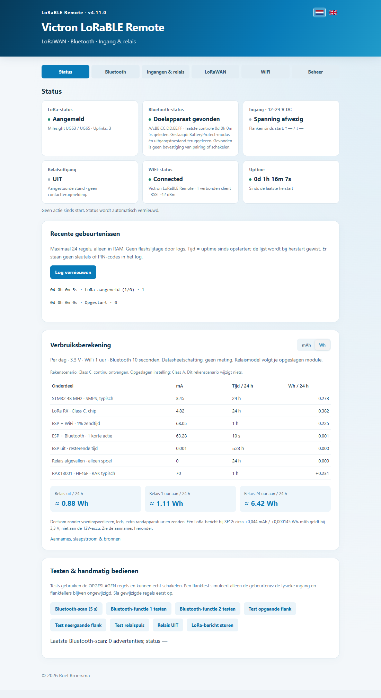

# Victron LoRaBLE Remote

Schakel een modem, router of andere belasting op afstand in — zonder die apparatuur voortdurend aan te laten staan.

[English](README.en.md) · [Download](https://github.com/roelbroersma/victron-lorable-remote/releases/latest) · [Installatie](docs/INSTALL.md) · [LoRaWAN instellen](docs/NETWORKS.md) · [Voorbeelden](docs/EXAMPLES.md)

LoRaBLE Remote verbindt **LoRaWAN met Bluetooth en relais**. Een klein RAK WisBlock-board ontvangt de eerste opdracht en schakelt bijvoorbeeld een Victron Smart MPPT, Smart BatteryProtect of relais. Zo zet je de voeding van een 4G/5G-modem of WiFi-router pas aan wanneer je die nodig hebt.

Gebruik je eigen LoRaWAN-netwerk — bijvoorbeeld met een **Milesight UG63 / UG65** — of een netwerk zoals **The Things Network (TTN)**. Vier netwerkprofielen bieden prioriteit, fallback en een instelbare terugkeertijd. Eén netwerk is tegelijk actief.

## Snel beginnen

1. Download **LoRaBLE-Remote-4.11.0-Windows.zip** bij de [laatste release](https://github.com/roelbroersma/victron-lorable-remote/releases/latest) en pak de ZIP volledig uit.
2. Sluit het RAK-board via zijn gewone USB-data-aansluiting aan en open **Install.cmd**. Kies NL of EN en volg de stappen. Zie de [compatibiliteit en installatievoorwaarden](docs/INSTALL.md).
3. Verbind na installatie met WiFi **Victron LoRaBLE Remote**, wachtwoord **CHANGE-ME-FIRST**, en open **http://192.168.4.1/**. Wijzig het wachtwoord meteen.
4. Kies je Bluetooth-apparaat, maak functies aan en vul je LoRaWAN-netwerkgegevens in. Koppel gewenste functies aan een ingang of LoRaWAN-opdracht.

Een eerste fabrieksinstallatie gebruikt USB en tijdelijk de WiFi van de pc. De wizard regelt die verbinding; Arduino IDE, Python en losse programmeerpinnen zijn niet nodig voor de ondersteunde fabrieksroute. Daarna gebruik je **één compleet `.bin`-bestand** voor updates via USB of **Beheer → Firmware bijwerken**.

## Wat kun je ermee?

| Onderdeel | Mogelijkheden |
|---|---|
| Victron Smart MPPT | Acht regelmodi voor de LOAD-uitgang |
| Victron Smart BatteryProtect | AAN/UIT met teruglezen van modus en uitgangsstatus; product A3B1, 12/24V-100A |
| Generic Bluetooth | Eigen GATT-service, characteristic en 1–20 opdrachtbytes |
| Bluetooth-functies | Maximaal tien benoemde opdrachten voor één doelapparaat |
| Ingangen en relais | Per opgaande/neergaande flank een Bluetooth-functie, LoRa-statusbericht en/of relaisactie |
| LoRaWAN | Vier OTAA-profielen, prioriteitsvolgorde, fallback, preempt-timer, Class A/C en opdrachttoestemmingen |
| WiFi | Instelbare tijdvensters na opstart, ingang of LoRa-opdracht |
| Webinterface | Nederlands/Engels, veldhulp, uptime, recente gebeurtenissen, handbediening en energie-inschatting |
| Beheer | Instellingen opslaan, exporteren/importeren en complete firmware bijwerken |

Interface met voorbeeldinstellingen.

## Hardware

| Onderdeel | Functie |
|---|---|
| **RAK11162** met RAK11160-module | LoRaWAN, WiFi en Bluetooth |
| **RAK19010** | WisBlock-basisboard |
| **RAK19012** | USB/LiPo/solar-voedingsmodule met USB-programmeeraansluiting |
| **RAK19016** | Alternatieve 5–24V-voedingsmodule voor gebruik na installatie |
| **RAK13001**, optioneel | Eén geïsoleerde 12–24V DC-input en één output/relais |
| **RAK13007**, optioneel | Eén output/relais, geen ingang |
| Antennes | Passende LoRa-antenne en 2,4GHz-antenne |

Zonder I/O-module kun je gewoon LoRaWAN → Bluetooth gebruiken. Selecteer de werkelijk gemonteerde I/O-module in de instellingen; modules worden niet automatisch herkend. Gebruik één voedingsmodule per power-slot.

RAK13001 detecteert de **aanwezigheid van 12–24V DC**: opgaand = spanning aanwezig, neergaand = spanning weg. De ingang is geen voltmeter. Sluit nooit 12V rechtstreeks op een processorpin aan. Controleer de modulejumpers: ingang op **WB_IO3**, relais op **WB_IO4**. De relais zijn niet bistabiel en verbruiken spoelstroom zolang ze aangetrokken zijn. Contacten leveren zelf geen voeding.

## LoRaWAN-opdrachten

Stuur **hexbytes**, geen ASCII-tekst, op de ingestelde FPort; standaard **10**. De bijbehorende functie en ontvangstrechten moeten ingeschakeld zijn.

| Payload | Actie |
|---|---|
| `01` … `09`, `0A` | Bluetooth-functie 1 … 10 |
| `10` | Relais UIT |
| `11` | Relais AAN |
| `12` | Relaispuls met ingestelde duur |
| `20` | Status opvragen |

Functie 10 is **`0A`**, niet `10`. De [payloadcodec](stm32/lorawan-payload-codec.js) bevat zowel Milesight `Decode` als TTN `decodeUplink`. Zie [netwerkinstellingen](docs/NETWORKS.md) voor registratie, kanaalplan, Class C en fallback.

## Energie en gebruik

Het voordeel zit in apparatuur die je **uit kunt laten**. Class C houdt de LoRa-ontvanger vrijwel continu beschikbaar en is geen microampère-slaapstand. Class A ontvangt alleen na een eigen uplink. De webinterface toont een datasheetgebaseerde dagraming in mAh of Wh, met WiFi- en relaisscenario's. Voedingsverliezen, aangesloten belastingen en werkelijk radioverkeer bepalen het totale verbruik.

WiFi pauzeert tijdens een Bluetooth-opdracht en keert daarna terug binnen het ingestelde tijdvenster. Herhalingen vinden alleen plaats na een mislukte poging. MPPT-modi User defined en AES gebruiken de drempels en tijden die al in VictronConnect zijn ingesteld. Andere BatteryProtect-productvarianten worden geweigerd; beveiligingsdrempels en BMS-modus blijven ongemoeid.

Voed het board onafhankelijk van de belasting die het schakelt. Houd ook je gateway bereikbaar wanneer het modem uitstaat. Gebruik passende bedrading, zekeringen en een lokale uitschakelmogelijkheid. Dit project is geen veiligheidscontroller; een ontvangen opdracht en een uitgevoerde actie zijn verschillende statussen.

## Instellingen en broncode

Instellingen blijven bij updates behouden. Ongewijzigd opslaan schrijft geen nieuw configuratierecord; gebeurtenissen en uptime blijven in RAM. Exports bevatten geen AppKeys, Bluetooth-PIN, WiFi-wachtwoord of netwerkidentiteiten. Bewaar die gegevens apart.

De Arduino-sketch staat in [stm32](stm32/stm32.ino). [Bouwinstructies](docs/DEVELOPMENT.md) beschrijven de firmware, webinterface, installer en releasebestanden. Download firmware alleen uit een vertrouwde bron en houd de voeding aangesloten tijdens updates; er is geen automatische rollback.

© 2026 Roel Broersma. Eigen projectcode: [MIT](LICENSE). Bibliotheken behouden hun [eigen licenties](THIRD-PARTY-NOTICES.md). Onafhankelijk project; niet verbonden aan Victron Energy, RAKwireless of Milesight.
